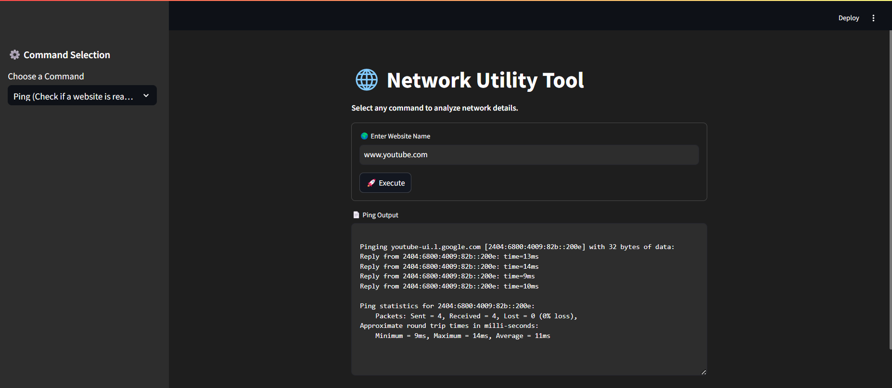
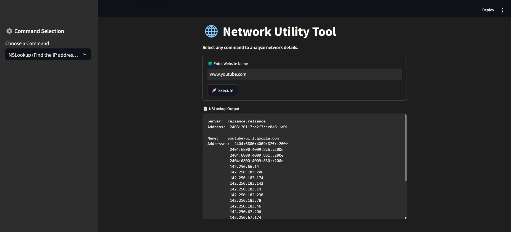
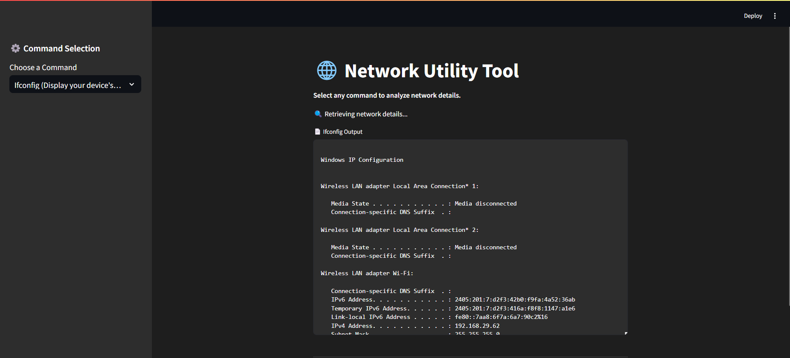
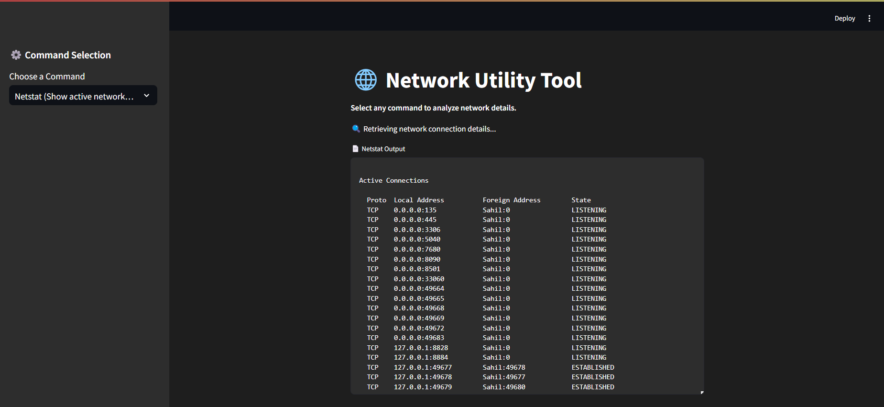
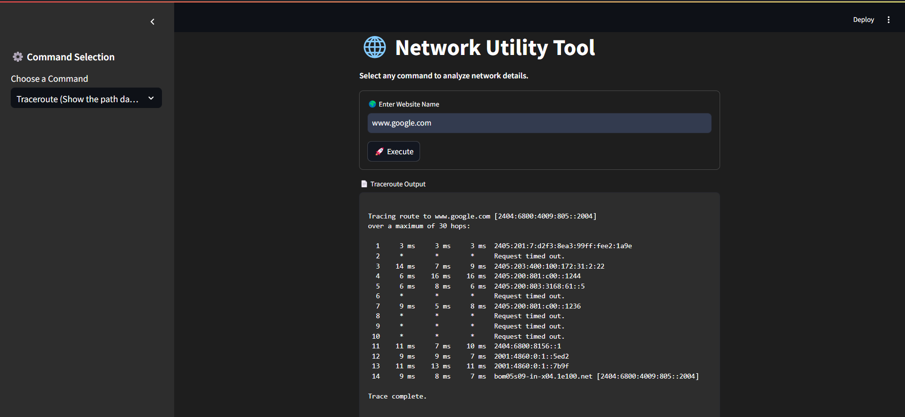

# 🌐 Network Utility Tool  

A simple **Streamlit** web application that provides essential network diagnostic tools such as **ping, nslookup, ifconfig, netstat, and traceroute** to analyze network details conveniently.  

## 🚀 Features  

- **Ping**: Checks website reachability and measures response time.  
- **NSLookup**: Resolves a domain name to an IP address.  
- **Ifconfig**: Displays network settings of the device.  
- **Netstat**: Shows active network connections.  
- **Traceroute**: Displays the path data takes to reach a website.  
- **User-Friendly UI**: Simple and interactive interface powered by **Streamlit**.  

## 🛠️ Installation  

### Prerequisites  
Ensure you have **Python 3.8+** installed on your system.  

### Steps  
1. **Clone this repository**  
   ```bash
   git clone https://github.com/yourusername/network-utility-tool.git  
   cd network-utility-tool  
   ```  
2. **Create a virtual environment (optional but recommended)**  
   ```bash
   python -m venv venv  
   source venv/bin/activate   # On macOS/Linux  
   venv\Scripts\activate      # On Windows  
   ```  
3. **Install dependencies**  
   ```bash
   pip install -r requirements.txt  
   ```  
4. **Run the application**  
   ```bash
   streamlit run app.py  
   ```  

## 📷 Screenshot  












## 📜 Usage  

1. Open the **Streamlit app** in your browser.  
2. Select a network command from the sidebar.  
3. If required, enter a website name.  
4. Click **Execute** to view results.  

## 🔒 Security Warning  

This tool executes system commands. Be cautious while running it on **shared or restricted environments** to avoid potential security risks.  

## 🤝 Contributing  

Feel free to fork this repository and submit **pull requests**! If you find bugs or want enhancements, create an **issue**.  

## 📜 License  

This project is licensed under the **MIT License**.  

---
